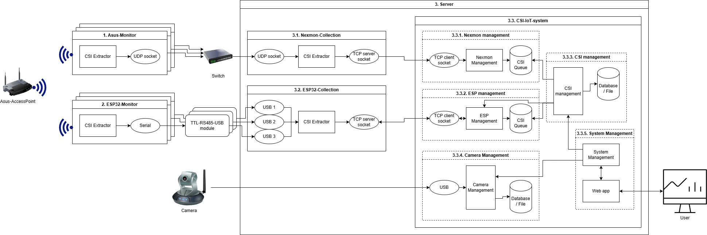

# HAR WiFi Sensing - Human Activity Recognition

## Overview
```text
📁 har_wifi
├── .git
├── .gitignore
├── docs                    # Documentations
├── nexmon_management       # Block 3.3.1 (see structure below)
├── LICENSE
└── README.md
```

## Project structure
